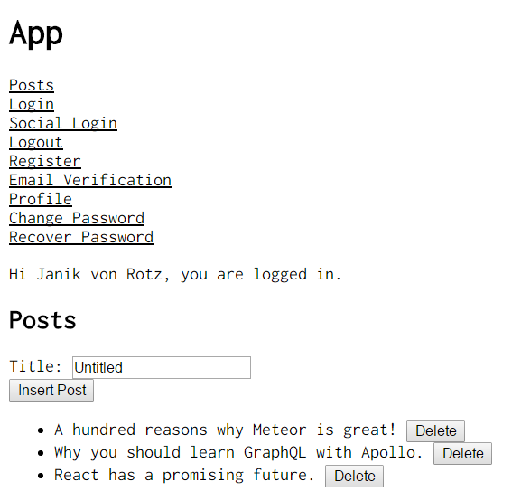

# Meteor Apollo Accounts Example

Example app implementing [Meteor Apollo Accounts](https://github.com/nicolaslopezj/meteor-apollo-accounts).  
Blog post: [Authenticate Meteor accounts with the Apollo GraphQL API](https://janikvonrotz.ch/2016/11/12/authenticate-meteor-accounts-with-the-apollo-graphql-api/)  

## Installation

* Git clone this repo
* Run `npm install` and `npm run`
* Go to [http://localhost:3000](http://localhost:3000) to use the app
* Or open [http://localhost:3000/graphiql](http://localhost:3000/graphiql) and test the API

## Features

* Authenticate users with Meteor accounts
* Use existing Apollo schemas
* Restrict access on the grapqhl API
* Redirect user access
* Register new users
* Email verification
* Password reset
* Update user profile

## Screenshot

## Todo

- [ ] Password change component
- [ ] User redirect on Profile access and Email Verification
